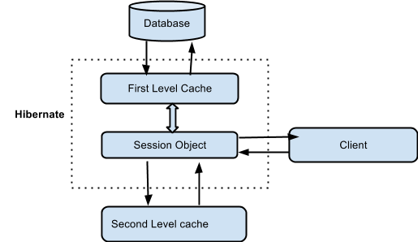

# Hibernate::Кэширование

## Кеширование

Кеширование является одним из способов оптимизации работы приложения, ключевой
задачей которого является уменьшить количество прямых обращений к базе данных



### Кэш первого уровня (First Level Cache)

Это внутренний кэш, который находится внутри фабрики сессий. Он кэширует
объекты, полученные в рамках одной транзакции и позволяет избежать повторной
загрузки объектов при повторном запросе к ним.
Пример использования первичного кэша:

    Session session = sessionFactory.openSession();
    MyEntity entity = session.get(MyEntity.class, entityId); // первичный 
        // запрос entity = session.get(MyEntity.class, entityId); // повторный 
        // запрос session.close();

Кэш первого уровня – это кэш Сессии (Session), который является обязательным.
Через него проходят все запросы. Перед тем, как отправить объект в БД, сессия
хранит объект за счёт своих ресурсов.  
В том случае, если мы выполняем несколько обновлений объекта, Hibernate
старается отсрочить (насколько это возможно) обновление для того, чтобы
сократить количество выполненных запросов. Если мы закроем сессию, то все
объекты, находящиеся в кэше теряются, а далее – либо сохраняются, либо
обновляются.

Кеш первого уровня всегда привязан к объекту сессии. Hibernate всегда по
умолчанию использует этот кеш и его нельзя отключить.

```java
public void Demo() {
    SharedDoc persistedDoc = (SharedDoc) session.load(SharedDoc.class, docId);
    System.out.println(persistedDoc.getName());
    user1.setDoc(persistedDoc);

    persistedDoc = (SharedDoc) session.load(SharedDoc.class, docId);
    System.out.println(persistedDoc.getName());
    user2.setDoc(persistedDoc);
}
```

В этом примере будет выполнен 1 запрос в базу, несмотря на то, что делается 2
вызова load(), так как эти вызовы происходят в контексте одной сессии. Во время
второй попытки загрузить план с тем же идентификатором будет использован кеш
сессии.

Один важный момент — при использовании метода load() Hibernate не выгружает из
БД данные до тех пор пока они не потребуются. Иными словами — в момент, когда
осуществляется первый вызов load, мы получаем прокси объект или сами данные в
случае, если данные уже были в кеше сессии. Поэтому в коде присутствует
getName() чтобы 100% вытянуть данные из БД. Тут также открывается прекрасная
возможность для потенциальной оптимизации. В случае прокси объекта мы можем
связать два объекта не делая запрос в базу, в отличии от метода get().

При использовании методов save(), update(), saveOrUpdate(), load(), get(),
list(), iterate(), scroll() всегда будет задействован кеш первого уровня.
Собственно, тут нечего больше добавить.

### Кэш второго уровня (Second level Cache)

Это распределенный кэш, доступный нескольким сессиям в приложении. Он кэширует
объекты, полученные при выполнении запросов к базе данных. Пример использования
вторичного кэша:

    @Entity @Cacheable @Table(name = "my_entity")
    @org.hibernate.annotations.Cache(usage = CacheConcurrencyStrategy.READ_WRITE)
    public class MyEntity implements Serializable {// ... }

Кэш второго уровня является необязательным (опциональным) и изначально Hibernate
будет искать необходимый объект в кэше первого уровня. В основном, кэширование
второго уровня отвечает за кэширование объектов

### Кэш запросов (Query Cache)

Это кэш, который используется для кэширования результатов выполнения запросов
в базу данных. Пример использования кэша запросов:

    Query query = session.createQuery("from MyEntity where name = :name");
    query.setParameter("name", "John");
    query.setCacheable(true);
    List<MyEntity> entities = query.list();

В Hibernate предусмотрен кэш для запросов и он интегрирован с кэшем второго
уровня. Это требует двух дополнительных физических мест для хранения
кэшированных запросов и временных меток для обновления таблицы БД. Этот вид
кэширования эффективен только для часто используемых запросов с одинаковыми
параметрами.

Developer.hbm.xml

```xml
<?xml version="1.0" encoding="utf-8"?>
<!DOCTYPE hibernate-mapping PUBLIC
        "-//Hibernate/Hibernate Mapping DTD//EN"
        "http://www.hibernate.org/dtd/hibernate-mapping-3.0.dtd">

<hibernate-mapping>
    <class name="net.proselyte.hibernate.nativesql.Developer"
           table="HIBERNATE_DEVELOPERS">
        <meta attribute="class-description">
            This class contains developer details.
        </meta>
        <id name="id" type="int" column="id">
            <generator class="native"/>
        </id>
        <property name="firstName" column="FIRST_NAME" type="string"/>
        <property name="lastName" column="LAST_NAME" type="string"/>
        <property name="specialty" column="SPECIALTY" type="string"/>
        <property name="experience" column="EXPERIENCE" type="int"/>
        <property name="salary" column="SALARY" type="int"/>
    </class>

</hibernate-mapping>
```

hibenrate.cfg.xml

```xml
<?xml version="1.0" encoding="utf-8"?>
<!DOCTYPE hibernate-configuration SYSTEM
        "http://www.hibernate.org/dtd/hibernate-configuration-3.0.dtd">

<hibernate-configuration>
    <session-factory>
        <property name="hibernate.dialect">
            org.hibernate.dialect.MySQLDialect
        </property>
        <property name="hibernate.connection.driver_class">
            com.mysql.jdbc.Driver
        </property>

        <!-- Assume PROSELYTE_TUTORIAL is the database name -->
        <property name="hibernate.connection.url">
            jdbc:mysql://localhost/ИМЯ_ВАШЕЙ_БАЗЫ_ДАННЫХ
        </property>
        <property name="hibernate.connection.username">
            ВАШЕ_ИМЯ_ПОЛЬЗОВАТЕЛЯ
        </property>
        <property name="hibernate.connection.password">
            ВАШ_ПАРОЛЬ
        </property>

        <!-- List of XML mapping files -->
        <mapping resource="Developer.hbm.xml"/>

    </session-factory>
</hibernate-configuration>

```

ehcache.xml

```xml

<diskStore path="java.io.tmpdir"/>
<defaultCache
maxElementsInMemory="500"
eternal="false"
timeToIdleSeconds="60"
timeToLiveSeconds="60"
overflowToDisk="true"
/>

<cache name="Developer"
       maxElementsInMemory="200"
       eternal="true"
       timeToIdleSeconds="0"
       timeToLiveSeconds="0"
       overflowToDisk="false"
/>
```

Для того, что кэширование стало доступным для нашего приложения мы должны
активировать его следующим образом:
[code lang=”java”]
Session session = sessionFactory.openSession();
Query query = session.createQuery(“FROM HIBERNATE_DEVELOPERS”);
query.setCacheable(true);
query.setCacheRegion(“developer”);
List developers = query.list();
sessionFactory.close();
[/code]